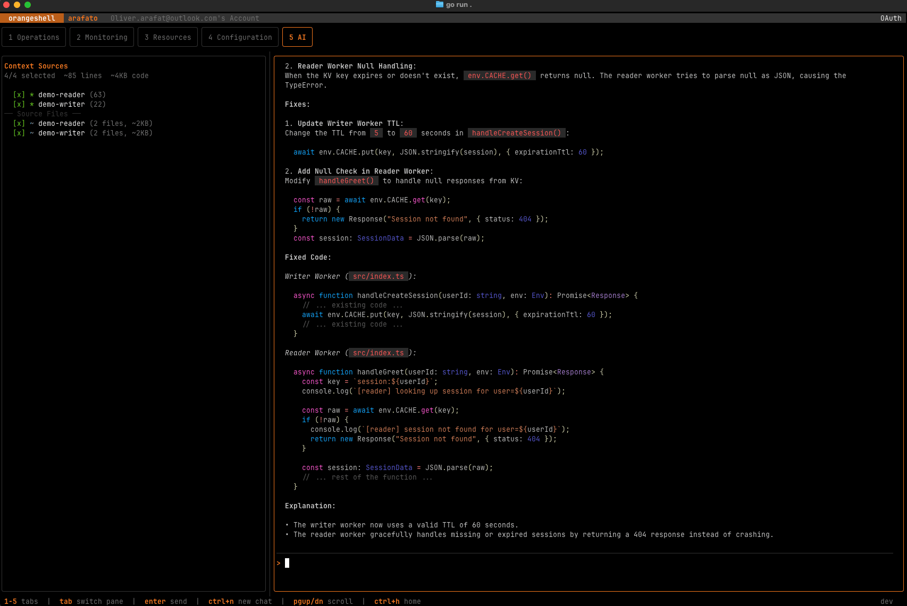

# 🍊 Orangeshell

A terminal UI for managing your Cloudflare Worker Projects — built around the wrangler workflow with first-class monorepo support.


<p align="center">
  
</p>

## Overview

Orangeshell is a local-first project orchestrator that bridges the gap between your workspace organization and Cloudflare’s application developer platform.

Unlike rigid IaC tools that force local and remote states to be identical, Orangeshell treats your local configuration as the "Source of Truth" for your management workflow. It provides a unified cockpit to organize, deploy, and maintain your Cloudflare resources without the fear of unintended side effects.

### How it Works

* Orchestrated Deployment: While Orangeshell excels at organizing local projects, its primary purpose is action. It streamlines the use of wrangler to deploy your code to Cloudflare with high-level efficiency.

* Local-First State: Removing a project from your Orangeshell view simply means "I no longer want to manage this project here." It decouples your organizational structure from the existence of the remote resource.

* Safety-Locked Destruction: Orangeshell respects your production environment. Infrastructure is only modified or destroyed through explicit, intentional consent, ensuring that local cleanup never turns into a remote outage by accident.

In short: Orangeshell is the control plane for your Cloudflare monorepo. It gives you the power to deploy at scale and the safety to organize your local workspace freely, ensuring that remote changes only happen when you mean them.

Point it at a directory with a `wrangler.jsonc` (or `.json` / `.toml`) and it shows you everything: environments, bindings, deployments, version splits, and live logs — all without leaving your terminal.

Drop it into a monorepo with multiple Workers and it discovers every project automatically, giving you a unified view across all of them.

Built with [Bubble Tea](https://github.com/charmbracelet/bubbletea) and the [Cloudflare Go SDK](https://github.com/cloudflare/cloudflare-go).

## Features

### Wrangler-native workflow

orangeshell reads your wrangler config directly. Environments, bindings, routes, and variables are displayed per-env with no extra configuration. Run `deploy`, `dev`, `versions list`, and other wrangler commands straight from the action menu (`Ctrl+P`).

### Monorepo support

When orangeshell detects multiple wrangler configs in the directory tree, it switches to a project list view. Drill into any project to see its full config, or stay on the list to get a bird's-eye view of deployment status across all Workers.

### Live log tailing

Press `t` to stream live logs from any Worker via the Cloudflare tail API. Logs are colored by level (request, log, warn, error) and displayed in a dedicated console pane.

In monorepo mode, **Parallel Tail** lets you stream logs from all Workers in an environment simultaneously in a 2-column grid — useful for debugging cross-service flows.

### Deployment visibility

Each environment shows its active deployment: version IDs, traffic split percentages, and workers.dev URLs (rendered as clickable terminal hyperlinks). "Currently not deployed" is surfaced clearly so you know exactly what's live.

### Version management

Deploy a specific version at 100% or set up gradual deployments with custom traffic splits — all from the version picker overlay.

### Binding management

Create new Cloudflare resources (D1 Databases, KV Namespaces, R2 Buckets, Queues) and wire them as bindings to any Worker — all without leaving the terminal. Press `Ctrl+N` to open the binding wizard, pick a resource type, create or select an existing resource, and the binding is written directly into your wrangler config.

### Service dashboard

Browse Workers, KV Namespaces, R2 Buckets, D1 Databases, and Queues from a unified dashboard. Drill into any resource to inspect its configuration, and cross-navigate between Workers and their bindings.

### Multi-account

Switch between Cloudflare accounts instantly with `[` / `]`. Deployment data is cached per-account for instant restore when switching back.

### AI-powered log analysis

The AI tab (`5`) connects to Workers AI to analyze your live logs. Select active tail sessions as context, ask questions, and get root-cause analysis — including cross-worker correlation for distributed architectures. On first use, orangeshell deploys a small proxy Worker to your account (no API keys needed). Choose between three model presets: Fast (8B), Balanced (70B), or Deep (32B reasoning).

### Dev mode tailing

When running `wrangler dev` or `wrangler dev --remote`, the dev worker appears in the Monitoring tab with a yellow `[dev]` badge. Logs stream into the tail grid alongside production tails. Press `c` on a dev entry to fire a cron trigger against the local dev server.

### D1 SQL console

Run SQL queries against D1 databases directly from the detail view. Schema is auto-loaded and refreshed after mutations.

## Full API Access (OAuth users)

When using **OAuth** authentication (the default via `wrangler login`), some Cloudflare APIs are inaccessible because the OAuth system does not support the required permission scopes. This affects:

- **Access Applications** — used to show access-protected badges on Workers
- **Workers Builds API** — used to show git metadata and build logs in version history

Without additional credentials, these features degrade silently (no errors — just missing data). The header shows a dimmed `(restricted)` indicator when this is the case.

### Automatic provisioning via environment variables

Set your **Global API Key** and **email** as environment variables:

```bash
export CLOUDFLARE_API_KEY="your-global-api-key"
export CLOUDFLARE_EMAIL="you@example.com"
```

On startup, orangeshell will automatically create a minimal scoped API token with just the two needed permissions (`Access: Apps and Policies Read` + `Workers CI Read`), save it to `~/.orangeshell/config.toml` as `api_token_fallback`, and use it going forward. The env vars are only needed once — after provisioning, the saved token is used on all subsequent launches.

### Manual token creation

If you prefer not to expose your Global API Key, you can create a scoped token manually and add it to your config:

```bash
curl -X POST "https://api.cloudflare.com/client/v4/user/tokens" \
  -H "X-Auth-Email: you@example.com" \
  -H "X-Auth-Key: YOUR_GLOBAL_API_KEY" \
  -H "Content-Type: application/json" \
  --data '{
    "name": "orangeshell (manual)",
    "policies": [{
      "effect": "allow",
      "resources": { "com.cloudflare.api.account.YOUR_ACCOUNT_ID": "*" },
      "permission_groups": [
        { "id": "7ea222f6d5064cfa89ea366d7c1fee89" },
        { "id": "ad99c5ae555e45c4bef5bdf2678388ba" }
      ]
    }]
  }'
```

Then add the returned token value to `~/.orangeshell/config.toml`:

```toml
api_token_fallback = "your-token-value"
```

### API Key and API Token users

If your primary auth method is **API Key** or **API Token** (with the required scopes), all features work out of the box — no fallback token is needed.

## Install

### Homebrew

```bash
brew tap arafato/tap
brew install orangeshell
```

### Download binary

Grab the latest binary for your platform from the [Releases page](https://github.com/arafato/orangeshell/releases).

### Run

```bash
orangeshell
```

On first launch, the setup wizard walks you through authentication (API Token, API Key + Email, or OAuth) and account selection. Configuration is stored in `~/.orangeshell/config.toml`.

## License

MIT
